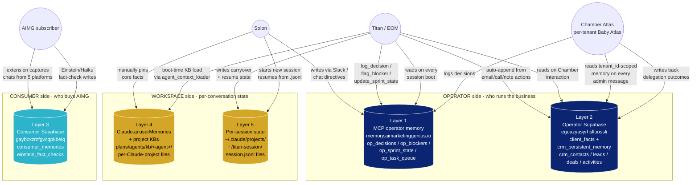

# Persistent Memory Schema — 5-Layer Architecture (CT-0417-29 T2)

**Status:** doctrine · written 2026-04-17 · supersedes nothing · informs `get_unified_context()` MCP tool spec (CT-0417-29 T3).

---

## Why this exists

There are 5 distinct memory substrates serving Solon, EOM, Titan, the AIMG consumer extension, and the Chamber Atlas runtime. Each has its own write-side, its own read-side, its own retention rules, and its own drift risk. `get_unified_context()` (T3) needs to know which one is source-of-truth for what before it can blend them — otherwise it will ship contradictions into Atlas's prompt.

This doc is the master map. Five layers, five owners, five drift surfaces.

---

## Layer map

---

## Per-layer source-of-truth + drift table

| # | Layer | Owner | Source-of-truth for | Drift partner | Drift type |
|---|---|---|---|---|---|
| **1** | **MCP operator memory** (`memory.aimarketinggenius.io`) | EOM + Titan | Decisions, blockers, sprint state, task queue, standing rules. Authoritative for anything tagged `[P10 PERMANENT]`. | Layer 4 (userMemories) — Solon may have older versions of the same rule pinned in Claude.ai before Titan canonicalizes to MCP | **Time-skew drift** — userMemory frozen at pin-time, MCP keeps moving |
| **2** | **Operator Supabase** `egoazyasyrhslluossli` (`client_facts`, `crm_*`) | Titan + EOM, scoped by `tenant_id` (RLS) | Per-Chamber + per-client structured data: contact-of-record, deal pipeline, activity log, persistent per-contact memory namespace | Layer 1 (MCP) — operator decisions tagged with `client:<slug>` should auto-mirror into Layer 2 activity feed. CT-0417-29 T7 builds this bidirectional sync. | **Sync drift** — if T7 sync breaks, Layer 1 + Layer 2 diverge silently |
| **3** | **Consumer Supabase** `gaybcxzrzfgvcqpkbeiq` (`consumer_memories`, `einstein_fact_checks`) | Each AIMG subscriber's extension, scoped by their auth.uid (RLS) | What an AIMG subscriber's chats produced — captured memories, fact-check verdicts, Hallucinometer scores. Never crosses tenant boundary into operator side. | None for the operator-stack reads. **AIMG-internal drift** between extension client cache + Supabase server state is the v0.1 counter=0 bug — being fixed in CT-0417-30. | **Eventual-consistency drift** — popup counter ≠ row count if RLS / auth refresh / embedding pipeline fails |
| **4** | **Claude.ai userMemories + project KBs** (`plans/agents/kb/<agent>/`) | Solon (userMemories) + Titan (KB files) | Bootstrap context — what every new Claude session loads on first turn. Identity files, banned-term lists, brand standards, error-pattern catalogs, agent capabilities. | Layer 1 (MCP) — when MCP standing rule changes, the corresponding KB file must be edited + committed too. CT-0417-25 didn't fully cascade Aria-retirement into KB files; CT-0417-26 partially closed it. | **Doctrine drift** — KB ages while MCP standing rule evolves; periodic audit (CT-0417-28 cadence) catches this |
| **5** | **Per-session state** (`~/.claude/projects/<flat-path>/<uuid>.jsonl`, `~/titan-session/`) | Each Claude Code session writes its own .jsonl + Titan's resume-state JSON | Conversation history of THIS session — exact prompts, exact tool calls, exact outputs. The .jsonl is the only canonical record of what was actually said in a Claude Code chat. | None directly — Layer 5 is append-only and not consumed by the operator stack at runtime. Used for forensic replay + carryover handoff. | **Path drift** — multiple `~/.claude/projects/-Users-...-titan-harness*` entries can fragment the same project's session history (CT-0417-27 T1 is mid-cleanup of this) |

---

## Authoritative-source rules (in priority order)

When `get_unified_context()` blends layers and there's a conflict, the resolution order:

1. **Layer 1 MCP `[P10 PERMANENT]` standing rule** wins over everything. These are explicit Solon-locked constraints and override stale data anywhere else.
2. **Layer 2 Supabase `crm_persistent_memory`** for per-contact specifics (Don's email, Revere Chamber's $1,000-3yr Corporate tier). Verified facts beat MCP narrative summaries.
3. **Layer 4 KB file content** for agent capabilities + brand standards (`plans/agents/kb/<agent>/00_identity.md`). These are versioned in git so they're auditable.
4. **Layer 1 MCP recent decisions** (last 30 days) for "what's currently in flight" context.
5. **Layer 5 session resume-state** for "what was Solon literally doing 5 minutes ago" continuity. Useful for mid-conversation pickup, NOT for cross-session truth.

Layer 3 (Consumer Supabase) is **never** read by the operator stack — strict tenant-isolation boundary.

---

## Duplication / redundancy map (where the same fact lives in multiple layers)

| Fact category | Lives in | Risk |
|---|---|---|
| Don Martelli's email + phone | Layer 2 (`crm_contacts.contact_email`, `contact_phone`) + Layer 1 (multiple decision logs reference him) + Layer 4 (`Encyclopedia v1.4.1` § Chamber contact card) | If Don changes email, all 3 must be updated. Layer 2 is canonical; Layer 1 + 4 should reference Layer 2, not embed. |
| Membership tier pricing ($100/$250/$500/$1000) | Layer 2 (`crm_deals.metadata` for any Revere member) + Layer 1 (CT-0417-19 RFP-validated decision) + Layer 4 (Encyclopedia §10.5 + Revere demo portal copy) | Layer 4 already verified against live RCoC site — if pricing shifts, Layer 4 is the trust anchor for client-facing surfaces, Layer 2 is the truth for internal billing math. |
| Atlas-sole-interface principle | Layer 1 (`P10 PERMANENT 2026-04-17 chamber-architecture` decision) + Layer 4 (Encyclopedia v1.4.1 §10.5.2.5) + Layer 4 KB (`plans/agents/kb/titan/00_identity.md` aspirational) + runtime code (`lib/atlas_api.py` system prompt) | High-stakes invariant. Drift would be catastrophic. Layer 1 is canonical; runtime code is enforcement; Layer 4 docs explain to humans. |
| Active client roster (5 clients per CT-0417-29 T6) | Layer 1 (decisions tagged with client slugs) + Layer 2 (`crm_contacts` after backfill) + Layer 4 KB (`plans/agents/kb/titan/00_identity.md` mentions roster) | Layer 2 canonical post-backfill. Layer 1 history retained for forensic. Layer 4 KB references "client roster" generically — no specific client names embedded, so no drift surface. |

---

## Open questions for runtime resolution

1. **Layer 5 forensic-replay budget:** every Claude Code session writes a complete .jsonl. Operator stack doesn't read these at runtime, but they're being kept indefinitely. Should we set a 90-day rotation? (Leaving open for now — disk cost is trivial.)
2. **Layer 4 KB freshness gate:** CT-0417-28 audit found doctrine-drift cadence is 7-day re-audit. Should the same cadence apply to KB files individually, or only to top-level doctrine? (Recommendation: KB files have their own `last_audited_at` line in YAML frontmatter; CT-0417-28 cadence sweeps both.)
3. **Layer 3 → Layer 1 emergency leak path:** if a critical AIMG subscriber issue is detected (e.g., persistence broken across the fleet), there should be a one-way audit pipe from Layer 3 → Layer 1 to flag it without violating tenant isolation. Currently no such pipe; gap noted for CT-0417-30.

---

## Implementation cross-references

- Layer 1 — `lib/agent_context_loader.py` MCP tool already loads it
- Layer 2 — `sql/008_amg_crm_contacts.sql` (CT-0417-29 T1 — applied 2026-04-17)
- Layer 3 — owned by AIMG extension repo `/opt/amg-memory-product/`; out of scope for operator stack
- Layer 4 — `library_of_alexandria/` + `plans/agents/kb/`; CT-0417-26 latest update
- Layer 5 — `~/.claude/projects/<flat-path>/`; CT-0417-27 T1 folder-lock cleans this up

CT-0417-29 T3 `get_unified_context()` MCP tool consumes Layers 1, 2, and 4 with the resolution priority above. Layer 3 + 5 are explicitly excluded from the operator-side blend.
